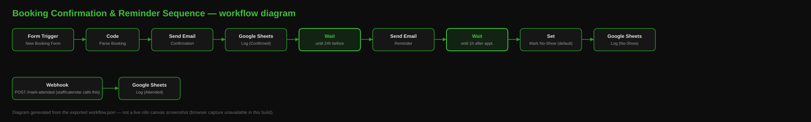

# n8n Booking Confirmation & Reminder Sequence

Confirms a new booking the moment it's made, sends a reminder ahead of the appointment, and flags no-shows automatically — no manual chasing.

Built by [Struct Solutions](https://struct.solutions), a UK-based AI automation consultancy — fixed-price n8n + AI workflow builds from £250.

## Who this is for

**Health & wellness practices** (clinics, salons, therapists) and **trades businesses** that take scheduled appointments and lose time to no-shows or forgotten bookings. Also a good fit for any professional-services business that books calls or site visits.

## How it works

### Main sequence (triggered by a new booking)
- **Form Trigger** ("New Booking Form") — captures Customer Name, Email, Phone, Service and the appointment date/time. Swap this for a webhook if you already have a booking widget (Calendly, Acuity, a custom site form) that can POST to n8n instead.
- **Code** ("Parse Booking") — parses the appointment time and computes two future timestamps: 24 hours before (for the reminder) and 1 hour after (for the no-show check).
- **Send Email** — sends an immediate confirmation.
- **Google Sheets** — logs the booking as "Confirmed".
- **Wait** (until 24h before the appointment) — n8n's Wait node pauses this specific execution without tying up a worker, then resumes automatically at the exact time.
- **Send Email** — sends the reminder.
- **Wait** (until 1h after the appointment) — pauses again.
- **Set + Google Sheets** — logs the booking as "No-Show (auto)" by default.

### Override path (triggered separately, any time)
- **Webhook** (`POST /mark-attended`) — call this from your booking system, calendar, or a simple staff-facing button any time after the appointment happens, with the booking's email/time in the body.
- **Google Sheets** — logs an "Attended" row.

Because the sheet is treated as an append-only event log, you get a clear timeline per booking (Confirmed → Reminder implied by timing → Attended *or* No-Show). Filter/pivot in the spreadsheet to see current status per booking.

**Why an event log instead of updating one row:** it's simpler to build and impossible to lose an update to a race condition between the "mark attended" call and the automatic no-show check. The tradeoff is you do a small pivot/filter in the sheet to see current state — documented here so it's a deliberate choice, not a gap.

## What it connects to

| Service | Used for | Required? |
|---|---|---|
| SMTP (email) | confirmation + reminder emails | Yes |
| Google Sheets | booking/status log | Yes |

No AI/LLM calls in this workflow — it's a pure scheduling/notification sequence.

## Setup

1. Import `workflow.json` into your n8n instance.
2. Add your SMTP credential to both **Send Confirmation Email** and **Send Reminder Email**.
3. Add your Google Sheets credential to all three Google Sheets nodes, and point `documentId` at a spreadsheet with a "Bookings" sheet.
4. Replace `hello@struct.solutions` with your own sending address.
5. Activate the workflow. Share the Form Trigger URL as your booking form, or point an existing booking system's webhook at the same intake logic.
6. Wire up "mark attended" however suits you: a button in your admin panel, a Zapier/Make step from your calendar, or just a quick manual POST request after each appointment.

### TODO / left for you
- Connect your own SMTP and Google Sheets credentials (not exported, for security) and the real spreadsheet ID.
- If you have an existing booking system with its own webhook, replace the Form Trigger with a Webhook node and map its fields instead.
- Consider adding SMS reminders (Twilio) alongside email if your customers respond better to text.

## License

MIT — see [LICENSE](LICENSE).
